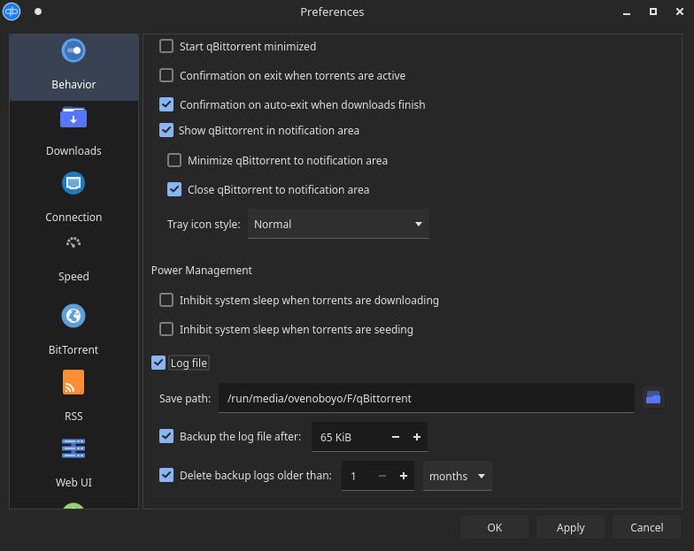

# Sync qBittorrent data between Linux and Windows dual boot

### Based on [Guide by Evert Mouw](https://www.furorteutonicus.eu/2021/03/21/shared-qbittorrent-data-on-a-dual-boot-pc/)

## Requirements
- qBittorrent
- Golang 1.17+ (if you want to build from source)
- Basic knowledge about linux
- Shared directory between windows and linux

## How to setup

### Creating a common directory

Create a directory in a common drive which is accessible from both your Windows and Linux

For eg. I've created a common directory in **D:\\\\qBittorrent**. In linux this directory is mounted at **/run/media/ovenoboyo/F/qBittorrent**


### Default save location

Change the default save path in qBittorrent in both windows and linux to the common directory you created in the above step




### .fastresume files

The torrent files and their state, fastresume files, are stored in these [locations](https://github.com/qbittorrent/qBittorrent/wiki/Frequently-Asked-Questions#where-does-qbittorrent-save-its-settings):

- Windows: ```%LOCALAPPDATA%\qBittorrent\BT_backup```
- Linux: ```~/.local/share/data/qBittorrent/BT_backup``` or ```~/.local/share/qBittorrent/BT_backup```

You also need to store the files in BT_backup in the same location, accessible by both Linux and Windows. The easiest way to do this is through symlinks

- Create a directory called **BT_backups** inside your common directory created [in first step](#creating-a-common-directory)

``` bash 
mkdir -p <path_to_your_common_directory>/BT_backup 
```

#### Symlinking files

- Symlink this directory to qBittorrent and copy all old files

#### In Linux:
``` bash
cd ~/.local/share/qBittorrent
mv BT_backup BT_backup_old
ln -s <path_to_your_common_directory>/BT_backup BT_backup
cp BT_backup_old/* BT_backup/
```

#### In Windows

- Open command prompt and type
  
``` cmd
cd %LOCALAPPDATA%\qBittorrent
ren BT_backup BT_backup_old
mklink /d BT_backup <path_to_your_common_directory>\BT_backup
copy BT_backup_old\* BT_backup 
```

### Converting savepaths between Linux and Windows

For qBittorrent to correctly identify where your file is stored, paths will need to be converted each time you login and logoff off Linux

To do this

- Download **qbittorrent_convert** from [Releases section](/Ovenoboyo/qbittorrent_convert/releases/download/v1.0.0/qbittorrent_convert)
- Put **qbittorrent_convert** inside 
  - ``` ~/.local/bin ``` (If you want it for the current user only)
  - ``` /usr/bin ``` (if you want it for your whole system)

- Create a script (You may copy the whole command below)
  - Replace <your_BT_backup_directory> with the path to directory created [after symlinks](#symlinking-files)
  
  - Replace <drive_letter_in_windows> with drive letter of common directory where your torrents are stored. 
    For eg: My torrents are stored in **D:\\Downloads**, so I will replace <drive_letter_in_windows> with **D:**
  
  - Replace <path_where_drive_is_mounted_in_linux> with the path where your torrent drive is mounted in Linux
    For eg: My **D:** drive is mounted at **/run/media/ovenoboyo/F/**, so I will replace <path_where_drive_is_mounted_in_linux> with **/run/media/ovenoboyo/F/**

``` bash
tee -a /usr/local/bin/qbittorrent_fastresume_savepaths_convert.sh <<EOF #!/bin/sh

case $1 in
windows) qbittorrent_convert --dir <your_BT_backup_directory> --newPath <drive_letter_in_windows> --ogPath <path_where_drive_is_mounted_in_linux> --linux false ;;
posix)   qbittorrent_convert --dir <your_BT_backup_directory> --newPath <path_where_drive_is_mounted_in_linux> --ogPath <drive_letter_in_windows> --linux true ;;
*)
echo "No valid first argument."
exit 1
;;
esac"
EOF

chmod +x /usr/local/bin/qbittorrent_fastresume_savepaths_convert.sh
```

- Create a new systemd service file (You may copy the whole command below)

``` bash
echo "[Unit]
Description=Converts qBittorrent shared storage between POSIX and Windows savepaths
After=multi-user.target
 
[Service]
Type=oneshot
RemainAfterExit=true
ExecStart=/usr/local/bin/qbittorrent_fastresume_savepaths_convert.sh posix
ExecStop=/usr/local/bin/qbittorrent_fastresume_savepaths_convert.sh windows
 
[Install]
WantedBy=multi-user.target" > /etc/systemd/system/qbittorrent_fastresume_savepaths_convert.service 
```

- You may now enable and start the service using
``` bash
systemctl enable qbittorrent_fastresume_savepaths_convert
systemctl start qbittorrent_fastresume_savepaths_convert
systemctl status qbittorrent_fastresume_savepaths_convert
```

This service will convert paths to Linux when your system starts. And it will convert them back to windows when your system stops.

If everything went successfully, Your qBittorrent should now show all your torrents from both Windows and Linux. And any future torrents should be synced 


